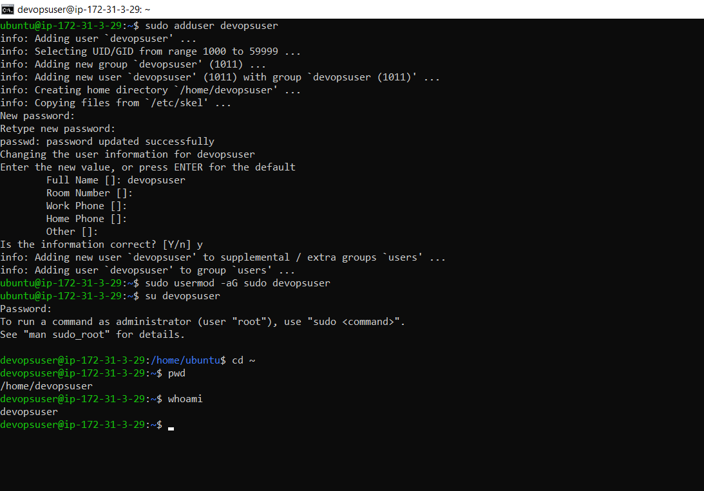
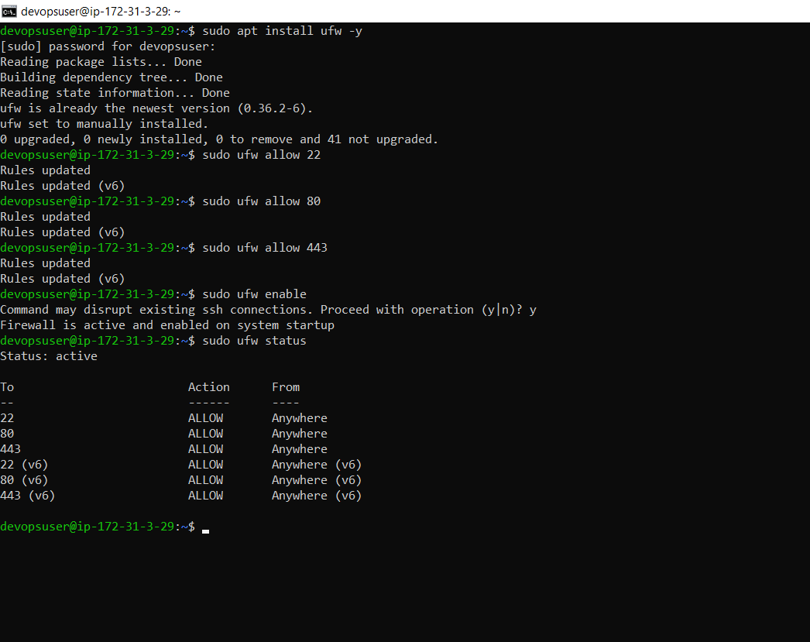
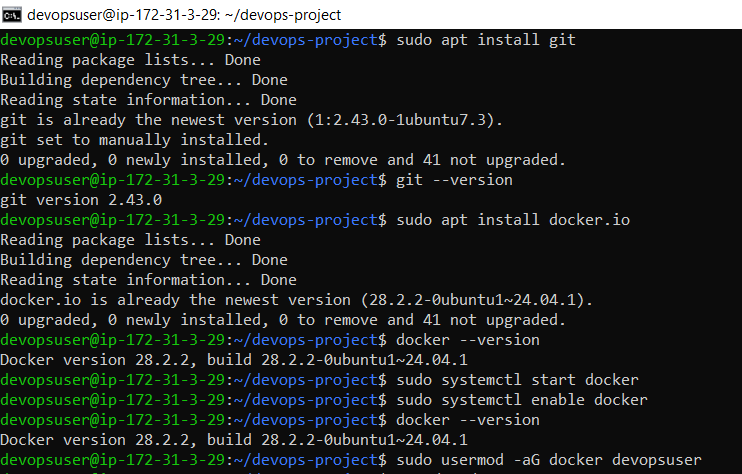
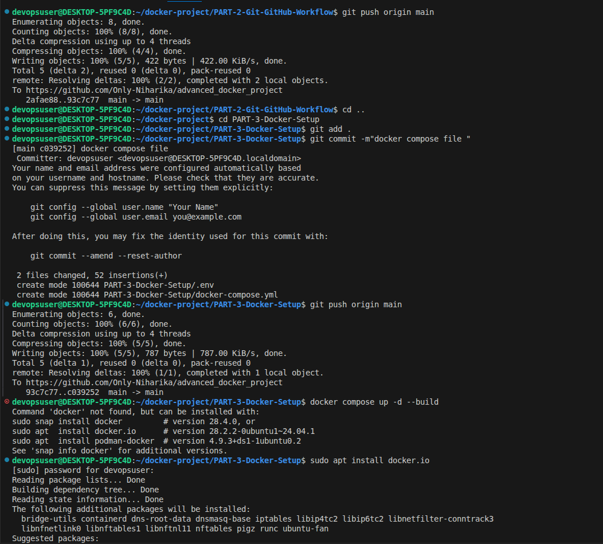
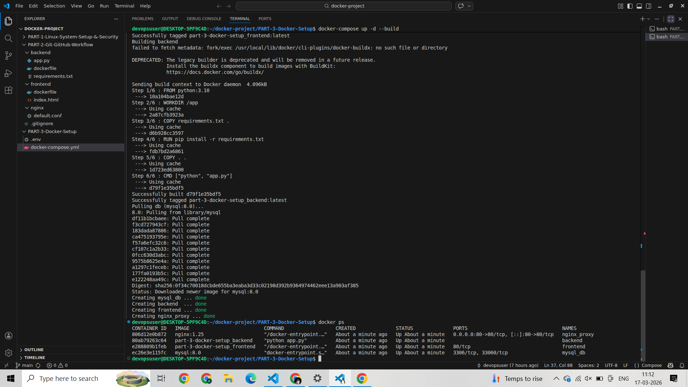
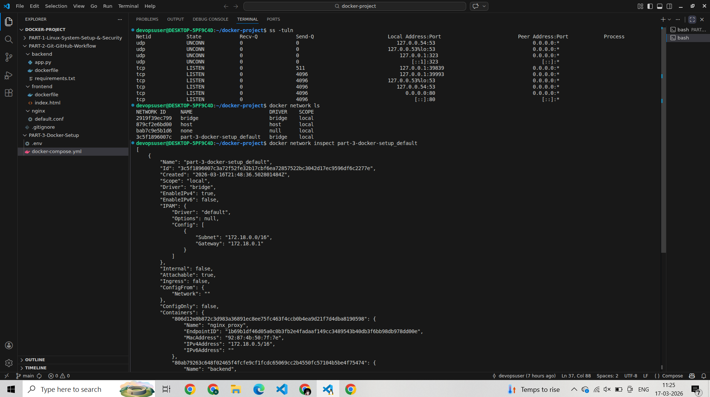
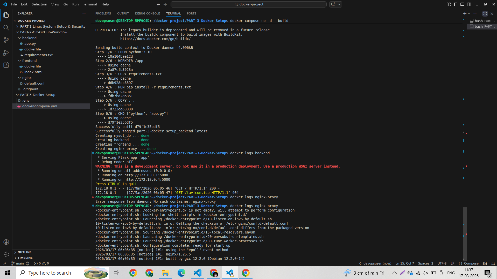

# Advanced DevOps Project Report (Part 1 to Part 6)

This report is arranged serially according to the required assignment parts, with screenshots and short explanations.

## PART 1 - Linux System Setup & Security

### 1. User creation and Docker group permissions
Short explanation: `devopsuser` was created and added to the `docker` group so Docker commands can run without `sudo` for that user.

### 2. Firewall (UFW) configured to allow only 22, 80, 443
Short explanation: UFW was enabled with inbound rules for SSH (22), HTTP (80), and HTTPS (443), matching the requirement.

### 3. Docker and Docker Compose installation check
Short explanation: Version output confirms Docker and Docker Compose are installed.

Note: `systemctl enable docker` is not visible in the provided screenshots.

## PART 2 - Git & GitHub Workflow

### Branching strategy and remote branch push
Short explanation: `develop`, `feature/frontend`, and `feature/backend` branches were created and pushed. GitHub PR creation links are visible in terminal output.

Note: Screenshots for 10 commits, `.gitignore`, `README.md` commit, tag `v1.0`, and main branch protection are not visible in the provided set.

## PART 3 - Multi-Container Docker Setup

### 1. Project structure in VS Code
Short explanation: Separate service folders and core files are present (`backend`, `frontend`, `nginx`, `.env`, `docker-compose.yml`).

### 2. Compose services running
Short explanation: `docker compose ps` shows all containers running (`adv_frontend`, `adv_backend`, `adv_db`, `adv_nginx`) and Nginx port mapping `8080 -> 80`.

Note: Browser-access screenshot and explicit DB persistence after restart screenshot are not visible in the provided set.

## PART 4 - Networking & Debugging

### 1. Open ports and running services
Short explanation: `docker compose ps` output confirms exposed host port `0.0.0.0:8080->80/tcp`.

### 2. Docker network inspection and logs
Short explanation: `docker network ls` shows custom network `advance-devops-project_app_network` with `bridge` driver, and logs are viewed using `docker compose logs -f`.

### 3. localhost vs 0.0.0.0
Short explanation: `localhost` binds to loopback only; `0.0.0.0` binds all interfaces.

## PART 5 - Production Best Practices

### Applied practices
1. Pinned image tags used (example: specific versions like `nginx:1.27-alpine`, `postgres:16-alpine`, `node:20-alpine`) instead of `latest`.
2. Credentials moved to environment variables via `.env`.
3. Recommended cleanup command: `docker system prune -a --volumes` (use carefully in non-production/local cleanup).
4. Why not `latest`: It is non-deterministic and can break reproducibility, rollback safety, and predictable deployments.

Note: No dedicated screenshot for Part 5 was included in the provided images.

## PART 6 - Monitoring

### 1. CPU and memory monitoring
Short explanation: `docker stats` is used to monitor live CPU and memory usage per container.

App URL: <http://localhost:8080>
